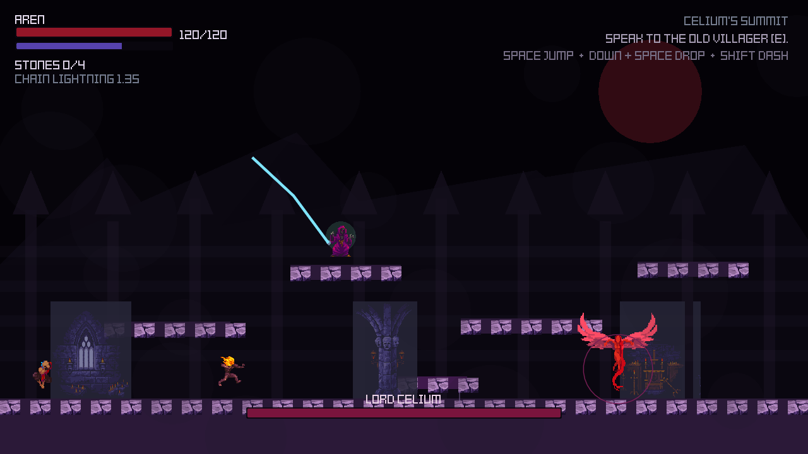

# Celium's Fall

A side-view dark fantasy action-platformer built with LÖVE. Aren, a former occult servant, jumps and fights across cursed forests, ruined churches, crypts, and Black Mountain while turning corrupted magic against Lord Celium's faction.



## Install and run

Install LÖVE 11.4+ from [love2d.org](https://love2d.org/) or with your system package manager. Then run:

```sh
make run
# Fallback: ./scripts/run.sh
# Direct: love .
```

No external assets or Lua packages are required. To publish later, add a remote with `git remote add origin <url>` and push the `main` branch.

## Controls

- A / D or left stick: move
- W / Up / Space or gamepad A: jump
- S / Down + jump or left stick down + gamepad A: drop through a one-way ledge
- Mouse or arrow keys: aim
- J / left mouse / gamepad X: melee
- K / right mouse / gamepad Y: magic projectile
- L / right shoulder: chain lightning after Sillius unlocks it
- Shift / gamepad B: dash
- E / left shoulder: interact / collect
- Enter: start / confirm / restart
- Esc: pause
- C on title: continue saved checkpoint
- Pause menu: adjust master volume, SFX volume, and mute with keyboard or controller
- Gamepad: left stick move, right stick aim, A jump, X melee, Y magic, B dash, Start pause

## MVP features

- Title, play, pause, death, restart, and victory states
- Side-view platforming with gravity, coyote-time jumping, drop-through ledges, moving platforms, solid walls, and aerial combat
- Three connected areas: Cursed Forest, Ruined Shrine, Black Mountain
- Nine rooms across the forest, shrine, and mountain route
- Skippable in-engine cinematics explain Aren's betrayal, the Covenant, the veil, and the road to Lord Celium
- Aren movement, dash, melee, magic, health, and mana
- Three regular enemies and two bosses with distinct behaviors
- Shielded Knight, Rift Witch, and Winged Curse enemy archetypes
- Grounded enemies use room-local platform routes to jump, descend, clear walls, and board moving platforms
- Four permanent stone upgrades and a moonstone side quest
- HUD, dialogue prompts, boss health bar, particles, hit flashes, and camera shake
- 640×360 pixel-native rendering with nearest-neighbor scaling
- GothicVania Church environment, animated character, enemy, and magic assets
- Procedural sound effects, persisted settings/checkpoints, and gamepad controls
- Navigable pause menu with separate master and SFX volume controls
- Sillius ally quest, temporary companion combat, and chain-lightning unlock
- Original Celium and Kenney Tiny Dungeon sprites remain as fallback assets

## Build

Create a portable LÖVE archive with `make build`. The result is `dist/celiums-fall.love` and can be opened by LÖVE on macOS, Windows, or Linux.

## Roadmap

Next priorities are full-route traversal, combat, and accessibility playtesting; authored ambience; and platform-specific releases. See [`docs/ROADMAP.md`](docs/ROADMAP.md).

## Validation

- `make check`: validate Lua syntax and run dependency-free unit tests.
- `make smoke`: exercise assets, every room, traversal, navigation, progression, and rendering through LÖVE.
- `make build && unzip -t dist/celiums-fall.love`: create and integrity-check the portable archive.

GitHub Actions runs the same checks headlessly on pushes and pull requests.
